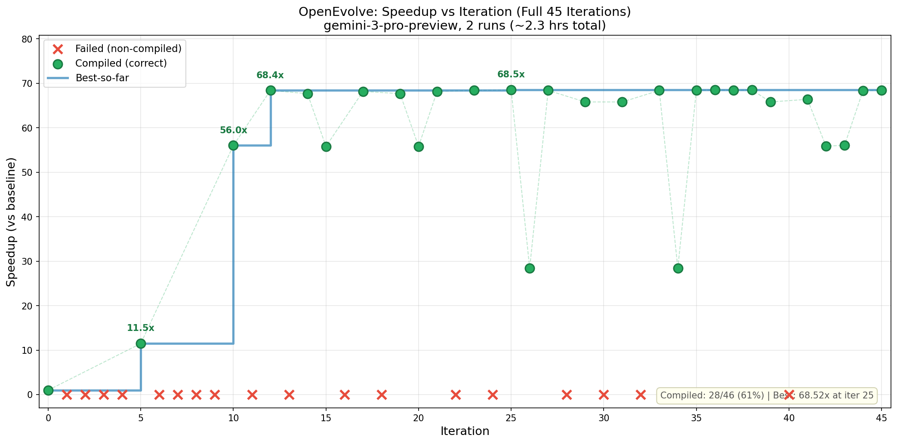

# OpenEvolve for Anthropic's Performance Take-Home

Using [OpenEvolve](https://github.com/algorithmicsuperintelligence/openevolve) to automatically optimize [Anthropic's performance take-home challenge](https://github.com/anthropics/original_performance_takehome).

For a detailed write-up, see [the blog post](TODO).

## Results

Gemini 3 Pro reaches **2,160 cycles** (68.4x speedup) in 15 iterations (~30 mins, ~$3) beating "Claude Opus 4 after many hours in the test-time compute harness", but then plateaus.



### Key observations

- Performance plateaus early - 68.4x by iteration 12, only +0.12x over next 33 iterations
- Most improvement happens in sudden jumps (1x -> 11x -> 56x -> 68x), not gradual gains
- 39% of evolved programs fail, with failures concentrated in the early generations before the system stabilizes

## Usage

```bash
# Install dependencies
uv sync

# Set up API key
cp .env.example .env  # add your GEMINI_API_KEY

# Run optimization
python main.py --config config-gemini-3-pro.yaml

# Resume from checkpoint
python main.py --config config-gemini-3-pro.yaml --checkpoint results/<run>/checkpoints/checkpoint_15
```
